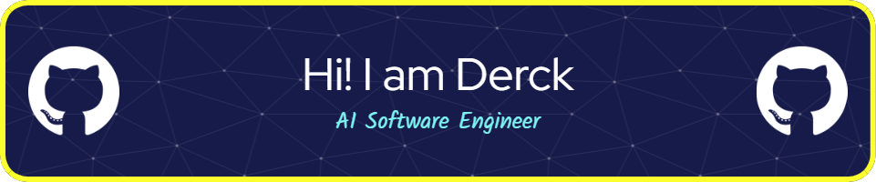

<!--
**dweprinz/dweprinz** is a ✨ _special_ ✨ repository because its `README.md` (this file) appears on your GitHub profile.
-->

<h1 align="center"> 👋 </h1>

  

 (Open for Hiring) 

<h2 align="center"> 👨‍💻 Whoami</h2>

  <samp>
<!--   A highly resourceful computer programmer and well-rounded IT professional with over five years of computing experience, possessing expert knowledge of the software development lifecycle and a solid understanding of technologies required for the development and deployment of highly available and scalable applications, including their networks and infrastructure. -->
  </samp>
     
  

<h2 align="center"> 🔭 Programming Languages</h2>

  
  &nbsp;&nbsp;&nbsp;
  
  

<h2 align="center"> 🔭 Machine Learning</h2>

  
  
  
  
  
  

<h2 align="center"> 🔭 Version Control</h2>

  
  
  
  
  
  

<h2  align="center">📫 Reach me on</h2>

  &nbsp;&nbsp;&nbsp;&nbsp;

- 🔭 I’m currently working on ...
- 🌱 I’m currently learning ...
- 👯 I’m looking to collaborate on ...
- 🤔 I’m looking for help with ...
- 💬 Ask me about ...
- 📫 How to reach me: ...
- 😄 Pronouns: ...
- ⚡ Fun fact: ...
